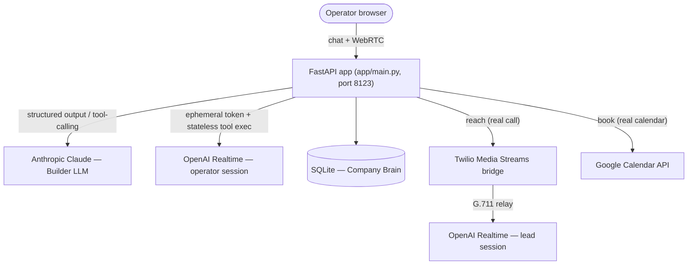

# 🎙️ AI Conductor

[](requirements.txt)
[](app/main.py)
[](app/db.py)
[](app/builder.py)
[](app/realtime.py)
[](app/realtime_bridge.py)
[](app/providers/book.py)
[](tests)

A two-agent voice AI assistant builder, in Python and FastAPI.

A **Builder** turns a natural-language description into a structured **Assistant Spec** (and edits it by chatting). The assistant that spec describes then runs live: a real spoken conversation over **OpenAI Realtime**, invoking tools — **reach, qualify, book** — non-linearly, letting the model decide what the conversation calls for. Voice covers two surfaces: the operator talks to the assistant directly over WebRTC, and `reach` can place a real phone call, itself a live Realtime conversation with the lead, bridged server-side over Twilio Media Streams. A scripted, linear **Runtime** (reach → qualify → book in a fixed order) remains underneath as the tested backend spine, reachable directly over the API/SSE. Both modes read from and write to a shared **Context Store** (a small "Company Brain"), so specs, leads, and outcomes accumulate in one inspectable place. Built as an AI-engineering take-home for Alta, a coordinated multi-agent GTM company.

## 📑 Table of Contents

- [🏗️ Architecture](#-architecture)
- [🎯 The three seams](#-the-three-seams)
- [💻 Local Development](#-local-development)
- [⚙️ Configuration](#-configuration)
- [🎙️ Voice (OpenAI Realtime)](#-voice-openai-realtime)
- [🔌 API](#-api)
- [⚖️ Key tradeoffs](#-key-tradeoffs)
- [🗺️ Roadmap](#-roadmap)
- [🧪 Testing](#-testing)
- [📁 Repo Layout](#-repo-layout)
- [👤 Author](#-author)

## 🏗️ Architecture



- **FastAPI app** (`app/main.py`) — single service. Serves the static frontend, the REST + SSE API, and mints Realtime tokens. `load_dotenv("secrets/.env", override=True)` runs at import so a running server always reflects the current `.env`, even under uvicorn's reloader.
- **Claude — Builder LLM** (`app/builder.py`) — *create* is one whole-spec structured-output call (also the reliability fallback); *edit* is a bounded tool-calling agent loop (`MAX_EDIT_ITERATIONS = 8`) that self-corrects on invalid tool arguments.
- **OpenAI Realtime — operator session** (`app/realtime.py`) — mints an ephemeral, spec-scoped session token for `POST /api/realtime/token`; audio never touches this server for this surface. Tool calls the model makes execute statelessly against `app/tool_exec.py`.
- **SQLite — Company Brain** (`app/db.py`, SQLModel) — specs, leads, run outcomes, qualification results, booked slots, and persisted provider settings, all in one inspectable file.
- **Twilio Media Streams bridge** (`app/realtime_bridge.py`) — relays a real phone call's audio to a second OpenAI Realtime session, so `reach` is itself a live conversation with the lead.
- **Google Calendar API** (`app/providers/book.py`) — only reached when `book` is set to the real provider; simulated by default.

Request flow: describe an assistant in chat → generate (validated, persisted) → edit (tool-calling loop) → talk to it live over Realtime, or drive the scripted spine directly over `POST /api/runs` + SSE → outcomes written back to the Company Brain either way.

## 🎯 The three seams

The brief left three questions open. Rather than guess, the system is built around seams that absorb each one without hardcoding an answer:

- **Generic schema** — the Assistant Spec is schema-driven, not hardcoded to one archetype. *Absorbs: one assistant type, or many?*
- **Open Tool Registry** — reach/qualify/book are registered tools, not hardcoded steps; adding a tool means registering it, not touching the Runtime.
- **Swappable Providers** — each tool is fulfilled by a Provider behind a fixed interface; simulated and real implementations are interchangeable.

Defaults used for the demo: one archetype, the reach/qualify/book tool set, simulated providers.

## 💻 Local Development

**Prerequisites:** Python 3.11+.

1. Create and activate a virtual environment, then install dependencies:

   ```bash
   python -m venv .venv
   # Windows: .venv\Scripts\activate   |   macOS/Linux: source .venv/bin/activate
   pip install -r requirements.txt
   ```

2. Create the secrets file from the template:

   ```bash
   copy secrets\.env.example secrets\.env
   ```

   (`cp secrets/.env.example secrets/.env` on macOS/Linux.) Fill in `secrets/.env` — see [Configuration](#-configuration).

3. Start the server:

   ```bash
   python -m app.main
   ```

4. Open `http://localhost:8123`.

Reset the demo data by deleting `db/ai_conductor.db` — it reseeds the 3 demo leads on next boot.

**Tests:** `pytest` (see [Testing](#-testing)).

## ⚙️ Configuration

`secrets/.env` is validated by `app/main.py` and the provider modules; everything except `.env.example` is gitignored.

| Variable | Required | Default | Notes |
|---|---|---|---|
| `ANTHROPIC_API_KEY` | yes | — | The Builder (spec generation/editing) and the simulated lead call (`app/sim_lead.py`). |
| `OPENAI_API_KEY` | yes | — | Required for voice. The operator session talks to OpenAI directly over WebRTC once this server mints it a token. |
| `PUBLIC_BASE_URL` | no | — | A URL Twilio can reach (e.g. an `ngrok http 8123` URL). Only needed for a real phone call; restart the server after setting it, since `.env` is only loaded once at import. |
| `PORT` | no | `8123` | Dev server port. |
| `AI_CONDUCTOR_DB` | no | `sqlite:///ai_conductor.db` | SQLite connection string. |
| `TWILIO_ACCOUNT_SID` / `TWILIO_AUTH_TOKEN` / `TWILIO_FROM_NUMBER` | no | — | Real phone calls for `reach`. Without these, `reach` runs the simulated two-agent call. |
| `HUBSPOT_API_KEY` | no | — | Real intent scoring for `qualify`. Preflight-checked before a run starts. |
| `GOOGLE_CALENDAR_CREDENTIALS` | no | — | Path to a Google credentials JSON, relative to the repo root. A service-account key books a real event but cannot invite attendees; `authorized_user` credentials act as you, so the invite goes out. |
| `GOOGLE_CALENDAR_ID` | no | `primary` | Only works with `authorized_user` credentials; a service-account key has no usable `primary` and needs a calendar shared with its address. |

## 🎙️ Voice (OpenAI Realtime)

Two conversations happen over voice, both on OpenAI Realtime:

- **Operator ↔ assistant.** The operator talks to the assistant directly in the session window over WebRTC — audio never touches this server. `POST /api/realtime/token` mints an ephemeral, spec-scoped token (only the spec's own tools, plus `list_leads` / `request_lead` / `web_search`, are offered); each tool call the model makes executes statelessly against `POST /api/realtime/tools/{tool_name}`. There's no lead dropdown — the model resolves who's meant via `list_leads`, or calls `request_lead` to have the operator pick.
- **Assistant ↔ lead.** `reach` places the actual call. By default it's simulated — a bounded text conversation between two models (`app/sim_lead.py`). With Twilio credentials and `PUBLIC_BASE_URL` configured, `reach` places a real phone call instead, bridged server-side to a second Realtime session (`app/realtime_bridge.py`); Twilio Media Streams and OpenAI Realtime both speak G.711 mu-law natively, so the bridge is a byte-for-byte audio relay. Either way the transcript comes back in the same shape and `qualify` scores it unchanged.

## 🔌 API

```
POST   /api/specs/generate              201  generate a spec from a description
GET    /api/specs                       200  list specs
GET    /api/specs/{spec_id}             200  fetch one spec
POST   /api/specs/{spec_id}/edit        200  tool-calling edit loop

POST   /api/runs                        202  trigger a scripted reach → qualify → book run
GET    /api/runs                        200  list runs
GET    /api/runs/{run_id}               200  fetch one run
GET    /api/runs/{run_id}/stream        200  SSE stream of run steps

GET    /api/providers                   200  available providers per tool
GET    /api/settings                    200  persisted provider selection
PUT    /api/settings                    200  set provider selection

GET    /api/leads                       200  list leads
POST   /api/leads                       201  create a lead
GET    /api/leads/{lead_id}             200  fetch one lead
DELETE /api/leads/{lead_id}             204  delete a lead

POST   /api/realtime/token              200  ephemeral, spec-scoped Realtime session token
POST   /api/realtime/tools/{tool_name}  200  stateless tool execution for a live session
POST   /api/realtime/web-search         200  bridges web_search to the Responses API

POST   /twilio/voice/{run_id}                Twilio voice webhook
POST   /twilio/status/{run_id}               Twilio call-status webhook
```

Example: driving the scripted spine directly, without opening a mic.

```bash
curl -X POST localhost:8123/api/specs/generate -H "Content-Type: application/json" \
  -d "{\"description\": \"An assistant that calls inbound leads, qualifies interest, and books a demo.\"}"

curl -X POST localhost:8123/api/runs -H "Content-Type: application/json" \
  -d "{\"spec_id\": 1, \"lead_id\": 1}"

curl -N localhost:8123/api/runs/1/stream
```

## ⚖️ Key tradeoffs

**Create vs. edit.** *Create* is a single whole-spec structured-output call — the reliable spine and the fallback if editing fails. *Edit* is a bounded tool-calling agent loop instead of just regenerating the whole spec, deliberately chosen since the role is at a company built on coordinated multi-agent systems. It's guarded with a hard iteration cap, error-feedback self-correction on invalid tool arguments, and a fallback to whole-spec regeneration on cap-hit or an unrecoverable error.

**Sync vs. async.** The reach → qualify → book sequence runs as `asyncio` tasks inside FastAPI and streams over SSE — no Celery/Redis/queue. Every step is persisted to SQLite as it completes, so SSE is a push layer over durable state, not the source of truth — a dropped connection reconnects and replays the full run from row zero.

**Why Realtime, not an earlier browser Web Speech + Claude loop.** Once both surfaces needed real voice, one vendor stack beat maintaining two audio pipelines. See `docs/DECISIONS.md` for the full tradeoff and what was deleted.

## 🗺️ Roadmap

- **Operator listen-in on a live phone call** — the operator and lead sessions are currently independent; there's no way to monitor or take over a real call in progress once `reach` places it.
- **Per-session provider settings** — provider selection is currently one global setting; scoping it per spec or per session would let two assistants run against different providers at once.
- **Multiple live assistant archetypes** — the schema already supports it; the demo just shows one.
- **Cross-run learning** — compounding intelligence from accumulated outcomes in the Company Brain.

Each sits behind an existing seam, so none of it requires rearchitecting. Full phase plan in `docs/PLAN.md`.

## 🧪 Testing

```bash
pytest
```

104 tests covering spec validation, the tool registry, the spec/context/settings stores, the scripted Runtime's branches (booked / no-answer / not-qualified / provider-error), the Realtime control plane and stateless tool executor, the Twilio ↔ OpenAI Realtime bridge (with fake sockets — no real calls), the Builder create-path validation and edit loop, and the API including SSE replay and 404 handling. All LLM and voice-provider calls are mocked — no network, no cost.

## 📁 Repo Layout

```
app/
  main.py                FastAPI app: REST + SSE API, static frontend, lifespan
  builder.py              Builder: create (structured output) + edit (tool-calling loop)
  spec.py                 Assistant Spec Pydantic models
  runtime.py               Scripted reach → qualify → book Runtime
  db.py                    SQLModel persistence — specs, leads, runs, settings
  tools.py / tools_manifest.py   Tool Registry
  providers/               Provider Layer: base.py + reach.py, qualify.py, book.py
  realtime.py               Realtime control plane: token mint + stateless tool exec
  realtime_bridge.py        Twilio Media Streams ↔ OpenAI Realtime bridge
  tool_exec.py               Stateless tool execution shared by the operator session
  sim_lead.py                 Simulated lead: two-agent bounded phone conversation
  call_prompt.py               Prompt assembly for simulated/real calls
docs/
  PLAN.md                  Phased implementation plan
  DECISIONS.md              Running decision log
static/                     Builder chat UI, live session UI (index.html, session.html, app.js, realtime.js, session.js)
tests/                       pytest suite (104 tests)
db/                          SQLite database file (gitignored)
secrets/                     .env and credential files (gitignored except .env.example)
requirements.txt             Python dependencies
```

## 👤 Author

**Yarin Solomon** — Full Stack Developer

- Email: [yarinso39@gmail.com](mailto:yarinso39@gmail.com)
- GitHub: [github.com/yarins0](https://github.com/yarins0)
- LinkedIn: [linkedin.com/in/yarin-solomon](https://www.linkedin.com/in/yarin-solomon/)
- Portfolio: [yarin-lab](https://yarin-lab.vercel.app/)
